<h3>1. Création du projet Spring Boot avec les dépendances</h3>

 

<h3>2. Création des entités JPA : Customer, BankAccount, SavingAccount, CurrentAccount, AccountOperation</h3>
<ul>
<li><h4>Customer.java</h4></li>

<li><h4>BankAccount.java</h4></li>

<li><h4>SavingAccount.java</h4></li>

<li><h4>CurrentAccount.java</h4></li>

<li><h4>AccountOperation.java</h4></li>

<li><h4>Les Enums</h4></li>
<li><h4>OperationType.java</h4></li>
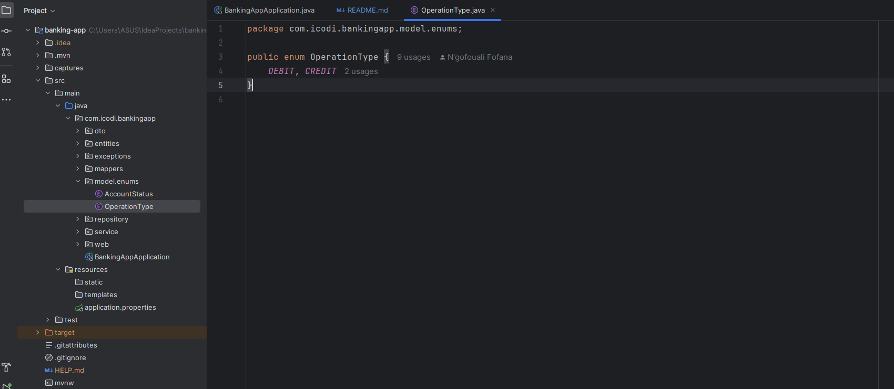
<li><h4>AccountStatus.java</h4></li>
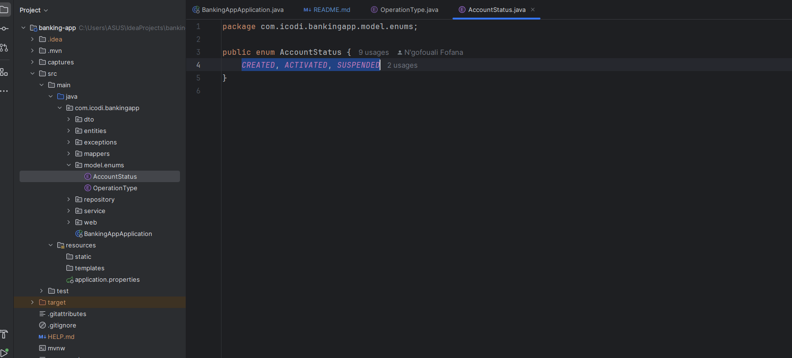
</ul>
 
<h3>3. Création des interfaces JPA Repository basées sur Spring Data</h3>
<ul>
<li><h4>CustomerRepository.java</h4></li>
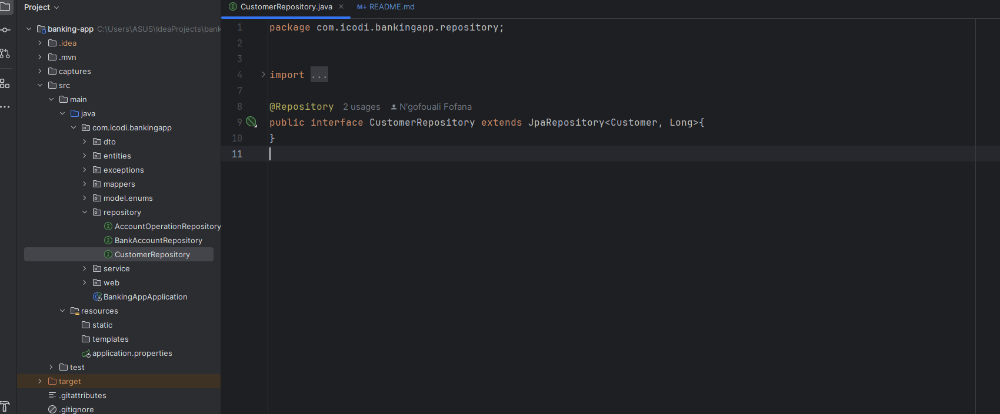
<li><h4>BankAccountRepository.java</h4></li>
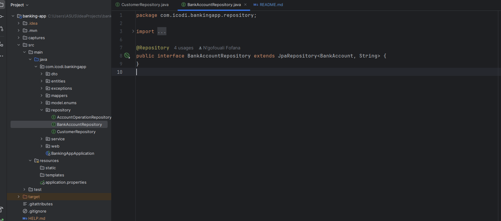
<li><h4>AccountOperationRepository.java</h4></li>
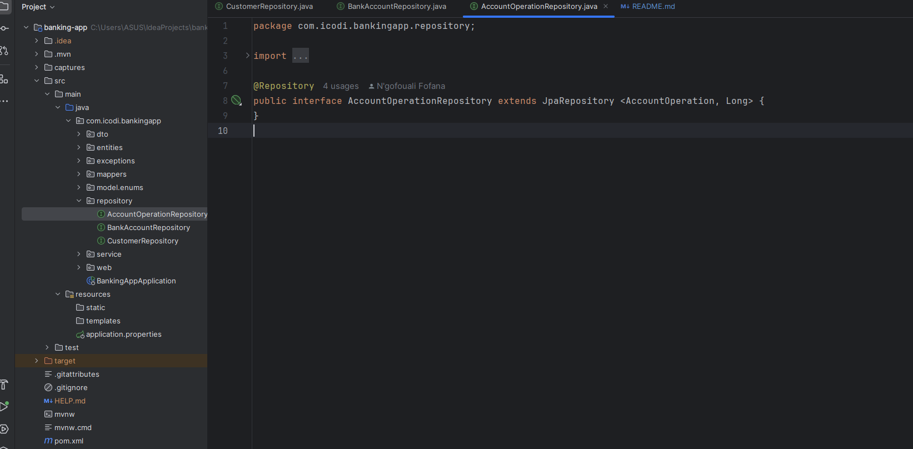
</ul>
<h3>4. Tester la couche DAO</h3><ul>
<li><h4>configuration de la base de données test - H2 - .application.properties</h4></li>
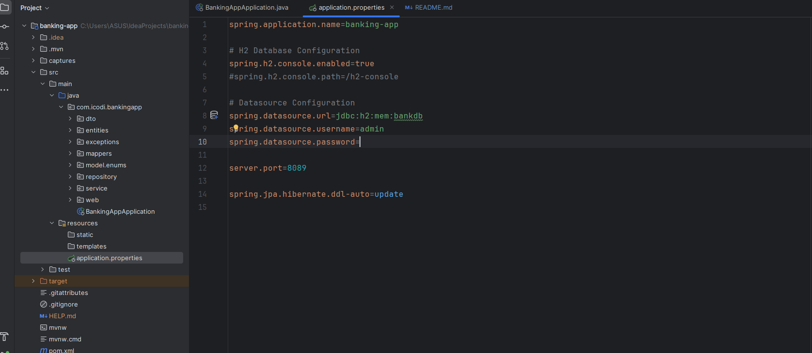
<ul>
<li><h4>Test des entités et des repository à l'aide des @Beans et @Builder</h4></li>
<li><h4>BankingAppApplication.java</h4></li>
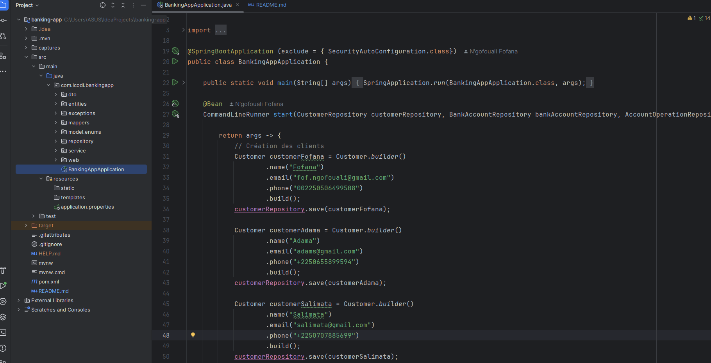
<li><h4>Connexion h2 database</h4></li>
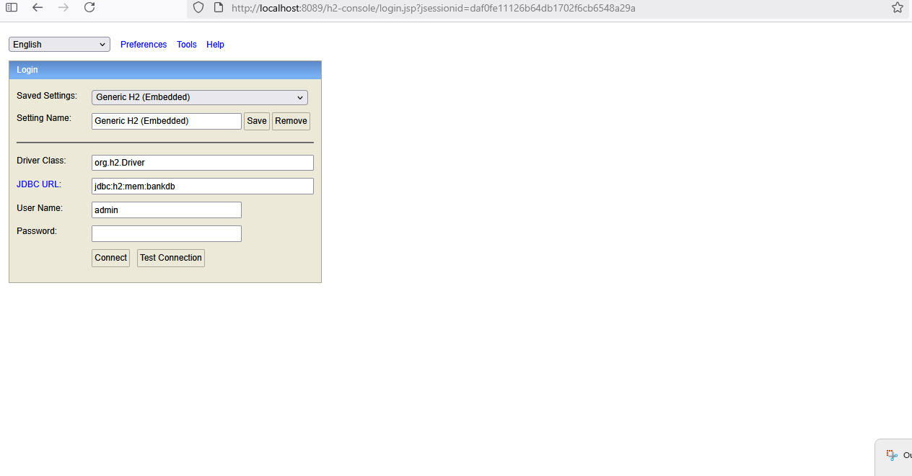
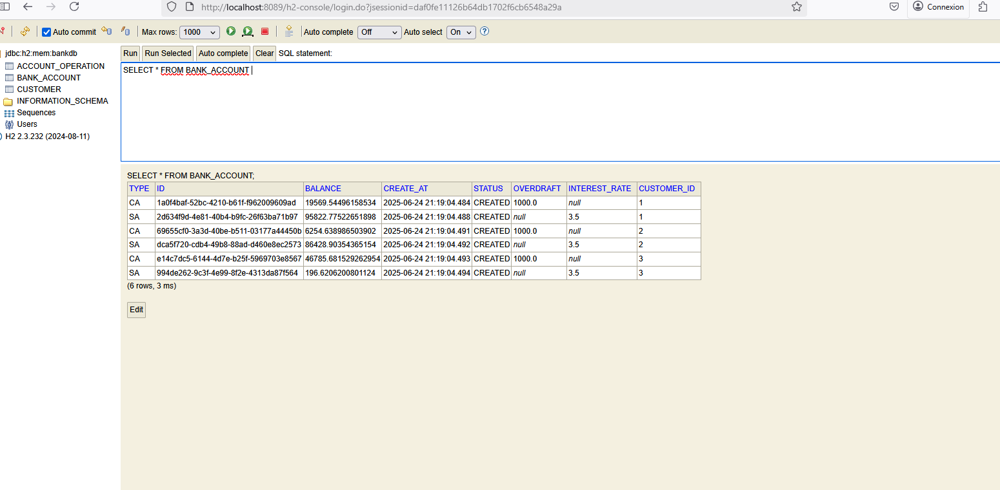
</ul>
<h3>5. Couche service, DTOs</h3>
<ul>
<li><h4>Les DTOs</h4></li>
<li><h4>CustomerDTO.java</h4></li>
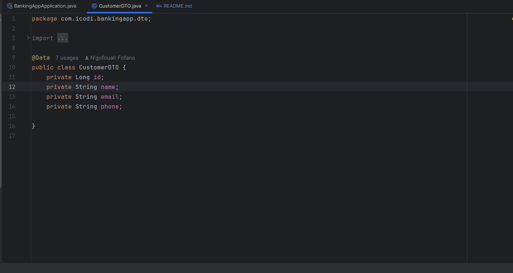
<li><h4>BankAccount.java</h4></li>
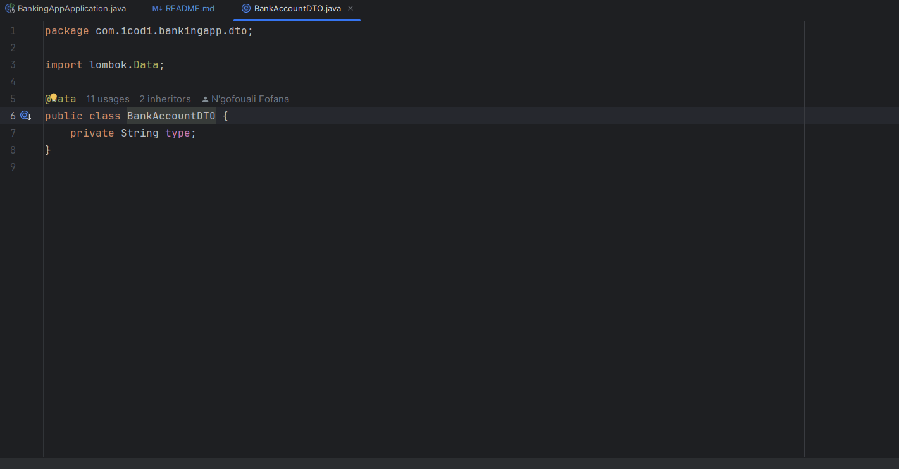
</ul>

