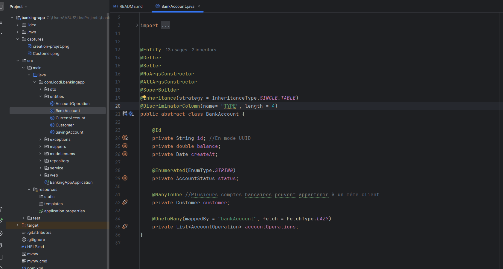

<h3>1. Création du projet Spring Boot avec les dépendances</h3>

 

<h3>2. Création des entités JPA : Customer, BankAccount, SavingAccount, CurrentAccount, AccountOperation</h3>
<ul>
<li><h4>Customer.java</h4></li>

<li><h4>BankAccount.java</h4></li>

<li><h4>SavingAccount.java</h4></li>

<li><h4>CurrentAccount.java</h4></li>

<li><h4>AccountOperation.java</h4></li>

</ul>

